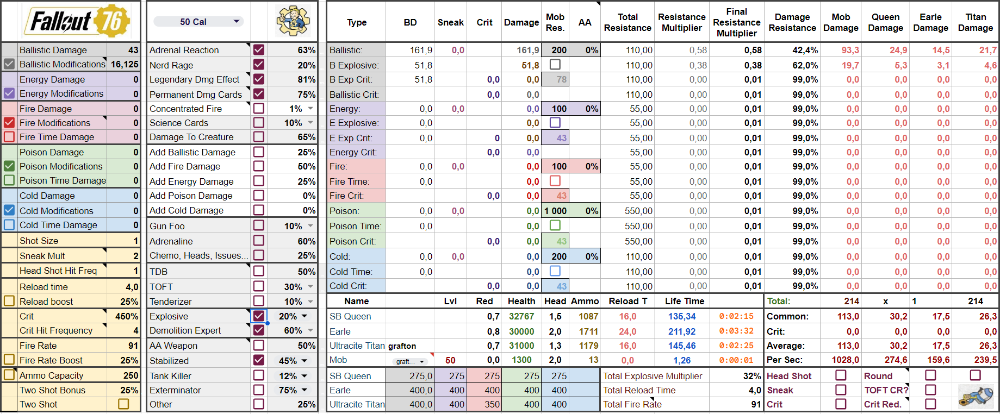
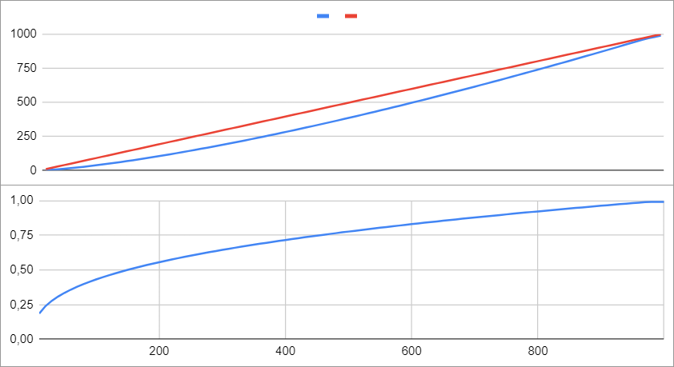
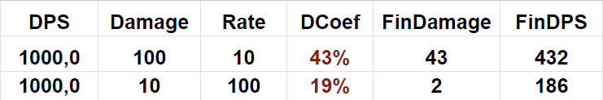
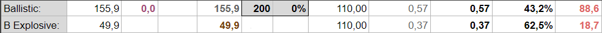
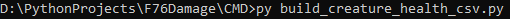

# F76Damage
[](https://www.python.org/downloads/)
[](https://www.jetbrains.com/pycharm/download/)
[](https://spreadsheets.google.com)
[](https://store.steampowered.com/app/1151340/Fallout_76)

## Table of Contents
1. [Damage calulator](#damage-calculator-for-fallout76)
2. [Resistance](#resistance-)
3. [Anti armor](#antiarmor)
4. [Damage](#damage-)
5. [Damage Reduction](#damage-reduction)
6. [HeadShot](#headshot)
7. [Sneak](#sneak)
8. [Crit](#crit)
9. [Two shot](#two-shot)
10. [Running scripts](#running-scripts)
11. [Google service account](#google-service-account)
 
### Damage calculator for Fallout76

A thing in RPGs, players worry most about is damage. Being a big fan of Bethesda and
Fallout universe in particular, I built this simple click-and-see calculator for myself to determine the best weapon 
for every situation, and may be it will also help you.

By using this Google spreadsheet calculator you can calculate the power of any weapon against any creature fast and easy.


To just work with ready-to-use google spreadsheet:
1. Download [Spreadsheet calculator](Resources/SS/Fallout76.xlsx)
2. Open [Google spreadsheet](https://spreadsheets.google.com/)
3. Create a blank spreadsheet 
4. Inside the spreadsheet menu choose: File->Import->Upload then drag the file downloaded in step 1
5. To use weapon comparison, [bind](https://spreadsheet.dev/buttons-in-google-sheets) this [macro](Resources/SS/AppScript.txt).

The calculator takes into account:

* 


 
damage
* Base damage + damage from mods
* Shot size
* Headshot with shot frequency
* Reload time
* Crit with shot frequency
* Sneak
* Fire rate
* Ammo capacity
* Two shot effect
* Explosive
* Anti armor
* Base damage effects
  * Adrenal reaction
  * Legendary effects (Aristocrat, Junkie, Bloodied,...)
  * Damage cards (Nerd rage, Heavy Gun, Bloody Mess, Adrenaline, Gun Foo,...)
  * Damage to a creature
  * Drink / Food / Chemicals / BubbleHeads / Magazines
* Total damage effects
  * Legendary effects (Executioner, Explosive,...)
  * Damage cards (Tenderizer, TakeOneForTheTeam,...)

Limitations (does not take into account):
*  
* Range
* Accuracy
* Sight
* Aiming speed
* Recoil
* Crippling
* Staggering
* Bleeding 
* Freezing
* Charging
* Action points
* Time damage (cause it works randomly and applies instantly without any time)

### Resistance 
Every enemy has a resistance value against all types of damage 


 


The more the resistance the more damage will be dispelled, the less will be applied.
The amount of damage inflicted to an enemy is determined by this formula:
```math
DamagePerc = \left(\frac{Damage * 0.15}{Resistance}\right)^{0,365}
```
The dependency between resistance and damage for a monster with 150 resistance points can be seen in the charts below:


**DamagePerc** represents the percentage of weapon's damage which will be applied to an enemy, for perc=0,7 and 100 
damage, 70 will be applied to an enemy, meaning that if an enemy has 140 health, it will be dead in two shots.

From this formula also follows, that the weapon with the same **DPS** (dmg / sec) will inflict different damage as shown bellow:

Despite the same base **DPS**, final **DPS** for a weapon with 100 damage is more than the weapon with 10 damage,
because an enemy resists to these damages differently.

### AntiArmor
To increase final damage, we can manipulate an enemy resistance by using anti armor effects.
Anti armor effects can be combined multiplicatively or additively.
Stabilized 3 rank +45% + AntiArmor +50% legendary effect + Penetrative magazine +20% will turn 200 resistance to
_200 * (1 - (0.5 + 0.2)) * (1 - 0.45) = 33_.

Anti armor effects always combined multiplicatively except for the case, when an AntiArmor mod applies to a weapon with AntiArmor legendary effect, in this case this two effects
are considered as single, fusing additively.

### Damage 
All **base damage boost effects** boost only base weapon damage, mod damage applies additively without boosting.
45 Level 50Cal Machine gun has 43 base damage and can have +25% from prime receiver mod, and +12.5% from heavy gun mod:
_43 + 43 * 0.25 + 43 * 0.125 = 43 + 16.125_.
All 3 rank heavy gun cards + bloody mess give _0.2 + 0.2 + 0.2 + 0.15 = 0.75_.
If we have 20% health, Nerd Rage gives +20% + Adrenal Reaction +50% (no team) + Bloodied Legendary +80%:
_0.75 + 0.2 + 0.5 + 0.8 = 2.25_.

The final result for 50Cal is _43 + 43 * 2.25 + 16.125 = ~155.8_

For some weapons, damage mods can be a part of base damage.
45 Level Ultracite Gatling Laser has 28 base damage and +25% from prime receiver mod. In this case 7 from prime receiver
is being a part of base damage 28 + 7 = 35. All base damage boost effects will amplify 35 instead of 28.

**Total damage boost effects** boost final damage, 20% Explosive + 60% Demolition Expert = 32% 
_(20 + 20 * 0.6 = 20 + 12 = 32). 155.8 + 155.8 * 0.32 = ~206._
TakeOneForTheTeam +40% + Tenderizer + 10% give _206 * 1.4 * 1.1 = ~317.2_

Explosive will not give you the damage you would expect because explosive part calculates separately as shown below:

That is the reason of why some weapon with solid damage (like GatlingPlasma) inflicts more damage to the same enemy with
the same resistance, even provided that the damage value for such a weapon is less than the damage value of explosive 
weapon.

### Damage Reduction
All final bosses have damage reduction parameter. It was introduced as a measure to increase bosses' health without 
increasing it.
A boss' health values are packed as +-2 bytes numbers, that means that a maximum health value will be $2^16=65536$, 
-32768 + 0 + 32767.
To increase the health of boss in 5 times, you can just decrease the final damage in 5 times, or, in other words, to
multiply final damage by (1 - 0.8) where 0.8 is damage reduction coefficient.

### HeadShot
HeadShot is considered a shot to a vulnerable part of body. It amplifies your damage after all calculations made.
Damage multipliers differ for different enemies (most often 1.3, 1.5, 2.0). If you have 200 damage weapon with 2.0 
headshot against an enemy with 100 resistance then the final damage is _200 * (0.15 * 200 / 100)^0.365 * 2.0 = ~257_.

### Sneak
Sneak is considered a **base damage boost** effect. The default value is 2.0 meaning that if your weapon has 43 base
damage value then it becomes 43 * 2.0 = 86, with 3 rank Covert Operative it becomes _43 * 2.5 = 107.5_, all other effects
applies as expected. +50% Junkie with + +50% Adrenal Reaction + +20% Nerd Rage gives 
_43 * 2.5 + 43 * (0.5 + 0.5 + 0.2) = ~159_. Total value can be amplified by **total damage boost** effects, in this case
TakeOneForTheTeam can work together with sneak in a case when an enemy hit you occasionally without seeing you or have
lost, you after you hit him back. 4 rank TOFT +40% + Tenderizer +10% + Executioner +50% gives _159 * 1.1 * 1.4 * 1.5 = ~367_.

### Crit

Crit applies additively without being boosted by other effects. The default value is +100% which increases base damage.
If your weapon has 43 base damage and 200 total damage then Crit attack gives _200 + 43 * 1 = 243_.
Crit stacks additively - +100% default value + +50% Eagle Eyes + +100% Better Critical + 100% from food gives 
200 + 43 * (1 + 0.5 + 1 + 1) = ~351. Crit reduces by **damage reduction** coefficient despite the fact that you can see 
displayed damage value without any reduction.

### Two Shot
Two shot effect works the same as single shot with 25% damage boost. It calculates as single shot but then, after 
the calculation, just splits by 2. If your weapon has 43 base damage and +70 from boosts then _43 * 1.25 + 70 = 123.75_,
against an enemy with 100 resistance - _123.75 * (0.15 * 123.75 / 100)^0.365 = ~70_ you will see two displayed shots 35
each. The additional benefit you can get from explosive weapon is where in this case an explosive part will be applied twice
instead of once.

## Running Scripts
After installing 
[](https://www.python.org/downloads/)
you can run several data generators from within CMD folder:

Use [Config](CMD/config.ini) to change / specify paths and other settings.

To generate weapon data, scripts use an incorporated decoder of .esm files.

To generate creature data, scripts use 'curve_table' json files, which are already presented in
[misc](Resources/Extracted/misc) folder, but they can be outdated. 

To generate up-to-date 'curve_table' json files:
```console
>py extract_ba2.py
```

This script uses ZeniMax Archive2.exe which you can find in 'CreationKit/Tools/Archive2' inside of
[](https://store.steampowered.com/app/1946160/Fallout_4_Creation_Kit/)


To generate names of all creatures in csv format:
```console
>py build_creature_names_csv.py
alien
alien_cpt-alpha-omega
alien_general-zeta
alien_lt-kappa
...
```

To generate health of all creatures and all levels (1-120):
```console
>py build_creature_health_csv.py
Name,Level,health
alien,1,66
alien,2,72.66666666666667
alien,3,79.33333333333334
alien,4,86
...
```

To generate resistance of all creatures and all levels (1-120):
```console
>py build_creature_resistance_csv.py
Name,Level,dr,er,fire,poison,cold,rad
alien,1,2,2,2,2,2,2
alien,2,2.0,2.0,2.0,2.0,2.0,2.0
alien,3,2.0,2.0,2.0,2.0,2.0,2.0
alien,4,2,2,2,2,2,2
alien,5,2.0,2.0,2.0,2.0,2.0,2.0
alien,6,2.0,2.0,2.0,2.0,2.0,2.0
alien,7,2,2,2,2,2,2
alien,8,6.0,6.0,6.0,6.0,6.0,6.0
alien,9,10,10,10,10,10,10
...
```

To generate weapons:
```console
>py build_weapon_csv.py
ID,NAME,ANIM_FIRE,RUMBLE_L,RUMBLE_R,RUMBLE_D,ANIM_RELOAD,SIGHTED_TRANS,UNSIGHTED_TRANS,SPEED,ATTACK_DELAY,CAPACITY,WEIGHT,ATTACK_SPEED,AP,ATTACK_RATE,MANUAL_RATE,DEF_FIRE_RATE
00001ba1,crScorchbeastSonicAttackWeapon,0.9670000076293945,0.5,1.0,0.33000001311302185,0.0,0.25,0.25,1.0,0.0,0,0.0,3.9666666984558105,0.0,2.521,0,91.0
00002045,binoculars,0.30000001192092896,0.800000011920929,0.6000000238418579,0.20000000298023224,10.0,0.15000000596046448,0.15000000596046448,1.0,10.0,30,2.0,0.30000001192092896,20.0,33.333,1.0,91.0
000021e0,zzz_AudioTestGrenade,0.699999988079071,0.10000000149011612,0.30000001192092896,0.15000000596046448,2.3333001136779785,0.25,0.25,1.0,0.0,0,0.5,1.8333333730697632,20.0,5.455,0,91.0
...
```

To generate weapon mods:
```console
>py build_weapon_mods_csv.py
00729bea,mod_Cremator_BarrelHose_Heavy,00729bea
,,0027abfa,MullAdd,ConIronSights,-0.25,0.0,
,,0027abfa,MullAdd,MaxRange,1.0,0.0,"Weapons\WeaponMods\Weapon_PARENT_Mod_LongRange_MaxRange.json
{'curve': [{'x': 1, 'y': 16}, {'x': 100, 'y': 16}]}"
,,0027abfa,MullAdd,MinRange,1.0,0.0,"Weapons\WeaponMods\Weapon_PARENT_Mod_LongRange_MinRange.json
{'curve': [{'x': 1, 'y': 9}, {'x': 100, 'y': 9}]}"
,,0027abfa,MullAdd,Value,0.2,0.0,
,,0027abfa,Add,Durability,-3,0,
,,00729bea,Set,AttackDelay,1.2,1.2,
,,00729bea,Set,ReloadSpeed,1.2,1.2,
,,00729bea,MullAdd,Weight,0.4,0.0,
,,00729bea,MullAdd,Value,0.4,0.0,
,,00729bea,Add,Durability,-8,0,
,,00729bea,Add,DamageTypeValues,Fire,0.0,"Weapons\WeaponMods\Incinerator_Mod_Heavy.json
{'curve': [{'x': 30, 'y': 30}, {'x': 40, 'y': 45}, {'x': 50, 'y': 60}]}"
...
```

### Google service account
To generate weapon / creature data and to send it to Google spreadsheet automatically, you need to 
[create service account](https://support.google.com/a/answer/7378726?hl=en), which could do this on your behalf.
After creating service account, credentials.json file will be downloaded automatically which you need to place in
[Creds](Resources/Creds) folder. The name of creds.json must be specified in [Config](CMD/config.ini) inside ([GSheet] Credentials)
category. The spreadsheet must be shared to this service account with 'Editor' privilege.

As for csv, the same scripts can be executed for Google spreadsheet:

```console
>py build_creature_names_gss.py
>py build_creature_health_gss.py
>py build_creature_resistance_gss.py
>py build_weapon_gss.py
>py build_weapon_mods_gss.py
>py build_all_to_gss.py
```

To extract all data from esm and ba2 files and send it go Google spreadsheet (for windows), run:
```console
generate_all_and_send_to_gss.bat
```